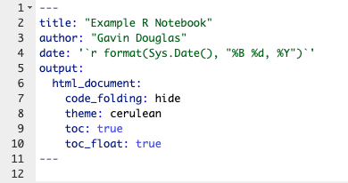
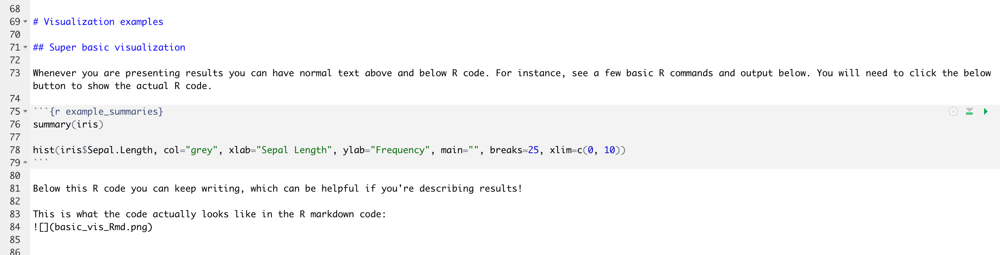
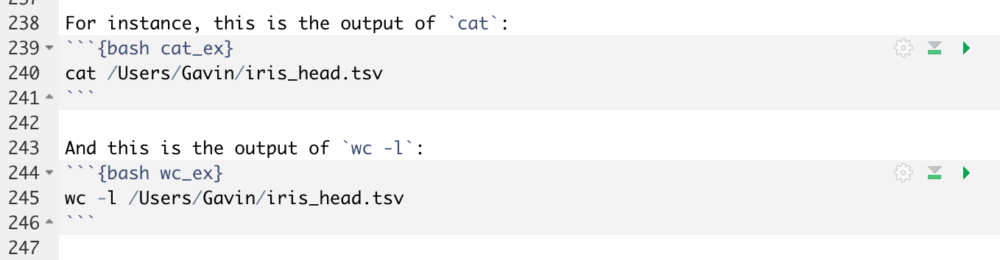
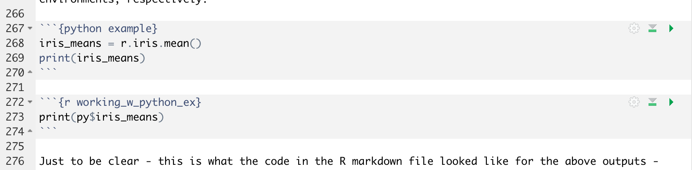
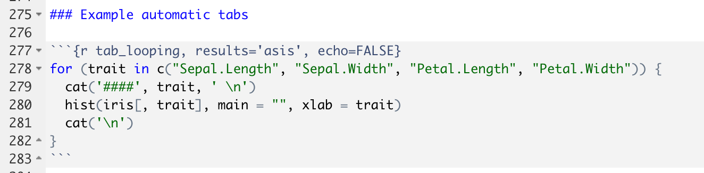

```{r setup, include=FALSE}
library(cowplot) # Needed to make easy multi-panel plots with ggplot2
library(DT) # Needed to make DT example table
library(ggbeeswarm) # Needed to make beeswarm plots
library(ggplot2) # Work-horse plotting package
library(kableExtra) # Needed to write out a formatted table
library(knitr) # Needed to set root directory
library(reticulate) # Needed for the Python code chunk 

theme_set(theme_classic())

# This is the Python to be used (which you would only specify if using Python code chunks)
use_python("/Users/Gavin/local/miniconda3/bin/python")

# You would need to change this folder to be wherever you wanted the html file to be written.
opts_knit$set(root.dir = '/Users/Gavin/Google_Drive/professional/gavinmdouglas.github.io/assets/workshops/R_notebook/')
```

# Introduction

R notebooks are a convenient and slick way to explore your data and share analyses with collaborators. The clearest advantage is that both the results and the code used are present in the same file and can be shared as an HTML file. This R notebook is intended to highlight the main R notebook features that I find helpful.

You can see the R code used at each step below, but for the purposes of this exercise **the full R markdown file will be more useful for understanding how to make a notebook like this**. This format (`.Rmd` rather than a standard `.R` script) is a markdown format that includes chunks of code (usually, but not always, in R). You can download the accompanying R markdown file [here](http://www.gavindouglas.ca/assets/workshops/R_notebook/code_example.Rmd).

For some reason the YAML header of this R notebook may not be visible when downloaded from this link (although it is present in the original file!). The YAML header looks like this in the original file (and is directly at the top of the notebook):

{width=250px}

## Highlight overview
Note the table of content that floats on the side of the page while scrolling. Settings like this, the particular layout, and whether code should be hidden by default, are specified at the beginning of the R markdown file. Another really handy feature of R notebooks is that you can execute specific chunks of code at a time - **this makes them useful for standard data analysis, when you might be re-writing and troubleshooting code, and not merely as a way to summarize final code**.

The other features that will be highlighted are:  
* Using tabs to present related data  
* Printing pretty tables  
* Using other languages besides R  

## Example dataset

The below examples will be with the default `iris` dataset, which is Fisher's (or Anderson's) famous dataset of measurements in centimetres of 50 flowers of three different iris species. The measurements are of the length and width of the petal and sepal for each flower.

# Visualization examples

## Super basic visualization

Whenever you are presenting results you can have normal text above and below R code. For instance, see a few basic R commands and output below. You will need to click the below button to show the actual R code.

```{r example_summaries}
summary(iris)

hist(iris$Sepal.Length, col="grey", xlab="Sepal Length", ylab="Frequency", main="", breaks=25, xlim=c(0, 10))
```

Below this R code you can keep writing, which can be helpful if you're describing results!

This is what the code actually looks like in the R markdown code:
  


## Presenting results with diff. tabs {.tabset}

One of my favourite features it to use tabs to visualize related data on the same page. This is super easy to do, because it just requires you to type `{.tabset} after a heading name and then automatically all sub-headings of the same level will be converted into tabs. As an example, boxplots of the measurements per iris species are shown in separate tabs for the sepal and petal data. The third tab is the petal data re-plotted but with different figure sizes set, which are often useful to change.

Note that as a bonus these boxplots also showcase the simple commands to make beeswarm plots (overlaid on top of boxplots) and multi-panel figures made with the cowplot package.

### Sepal

Here is the sepal data, note that this text is different for each tab!

```{r sepal_boxplots}

sepal_length_boxplot <- ggplot(data=iris, aes(x=Species, y=Sepal.Length, fill=Species)) +
                         geom_boxplot(outlier.shape = NA) +
                         geom_beeswarm(cex=1, size=1) +
                         scale_fill_manual(values=c("#1b9e77", "#d95f02", "#7570b3")) +
                         ylab("Sepal Length") +
                         xlab("Species") +
                         ylim(c(0, 8)) +
                         theme(axis.text.x = element_text(angle = 45, vjust = 1, hjust=1),
                         legend.position = "none",
                         panel.background = element_rect(fill = 'grey85'))

sepal_width_boxplot <- ggplot(data=iris, aes(x=Species, y=Sepal.Width, fill=Species)) +
                         geom_boxplot(outlier.shape = NA) +
                         geom_beeswarm(cex=1, size=1) +
                         scale_fill_manual(values=c("#1b9e77", "#d95f02", "#7570b3")) +
                         ylab("Sepal Width") +
                         xlab("Species") +
                         ylim(c(0, 5)) +
                         theme(axis.text.x = element_text(angle = 45, vjust = 1, hjust=1),
                         legend.position = "none",
                         panel.background = element_rect(fill = 'grey85'))

plot_grid(sepal_length_boxplot, sepal_width_boxplot, labels = c('a', 'b'))
```

### Petal

Here is the petal data, note that this text is different for each tab!

```{r petal_boxplots}
petal_length_boxplot <- ggplot(data=iris, aes(x=Species, y=Petal.Length, fill=Species)) +
                         geom_boxplot(outlier.shape = NA) +
                         geom_beeswarm(cex=1, size=1) +
                         scale_fill_manual(values=c("#1b9e77", "#d95f02", "#7570b3")) +
                         ylab("Petal Length") +
                         xlab("Species") +
                         ylim(c(0, 8)) +
                         theme(axis.text.x = element_text(angle = 45, vjust = 1, hjust=1),
                         legend.position = "none",
                         panel.background = element_rect(fill = 'grey85'))

petal_width_boxplot <- ggplot(data=iris, aes(x=Species, y=Petal.Width, fill=Species)) +
                         geom_boxplot(outlier.shape = NA) +
                         geom_beeswarm(cex=1, size=1) +
                         scale_fill_manual(values=c("#1b9e77", "#d95f02", "#7570b3")) +
                         ylab("Petal Width") +
                         xlab("Species") +
                         ylim(c(0, 3)) +
                         theme(axis.text.x = element_text(angle = 45, vjust = 1, hjust=1),
                         legend.position = "none",
                         panel.background = element_rect(fill = 'grey85'))

plot_grid(petal_length_boxplot, petal_width_boxplot, labels = c('a', 'b'))
```


### Petal re-sized

Here is the petal data re-plotted to be a different size. Figure sizes are often necessary to change so that they can be visualized correctly.

```{r petal_boxplots_diff_size, fig.height=5, fig.width=10}

petal_length_boxplot <- ggplot(data=iris, aes(x=Species, y=Petal.Length, fill=Species)) +
                         geom_boxplot(outlier.shape = NA) +
                         geom_beeswarm(cex=1, size=1) +
                         scale_fill_manual(values=c("#1b9e77", "#d95f02", "#7570b3")) +
                         ylab("Petal Length") +
                         xlab("Species") +
                         ylim(c(0, 8)) +
                         theme(axis.text.x = element_text(angle = 45, vjust = 1, hjust=1),
                         legend.position = "none",
                         panel.background = element_rect(fill = 'grey85'))

petal_width_boxplot <- ggplot(data=iris, aes(x=Species, y=Petal.Width, fill=Species)) +
                         geom_boxplot(outlier.shape = NA) +
                         geom_beeswarm(cex=1, size=1) +
                         scale_fill_manual(values=c("#1b9e77", "#d95f02", "#7570b3")) +
                         ylab("Petal Width") +
                         xlab("Species") +
                         ylim(c(0, 3)) +
                         theme(axis.text.x = element_text(angle = 45, vjust = 1, hjust=1),
                         legend.position = "none",
                         panel.background = element_rect(fill = 'grey85'))

plot_grid(petal_length_boxplot, petal_width_boxplot, labels = c('a', 'b'))
```

## Tables

### Kable table {.tabset}

A really easy and clean way of visualizing tabular data is to output it with `kable()`. The below tables are based on the first ten rows of the `iris` dataset. A major advantage of kable tables are that you can alter the colour of cells and the colour and size of cell values. You can see some examples in the below tabs, some of which I came across in this tutorial: https://cran.r-project.org/web/packages/kableExtra/vignettes/awesome_table_in_html.html.

#### Basic

```{r iris_table_basic}
head(iris, n = 10) %>%
  kable() %>%
  kable_styling(full_width = FALSE)
```

#### Table with title and classic format

```{r iris_table_title_classic}
head(iris, n = 10) %>%
  kable(caption = "Head of iris data") %>%
  kable_classic(full_width = FALSE, html_font = "Cambria")
```

#### Fixed header position (first 100 lines)

```{r iris_fixed_header, fig.height=2 }
head(iris, n = 100) %>%
  kable() %>%
  kable_styling(full_width = FALSE, fixed_thead = TRUE)
```

#### Coloured cells and values based on values

```{r iris_coloured_col1}
head(iris, n = 10) %>%
  kable() %>%
  kable_styling(full_width = FALSE) %>%
  column_spec(2, color = spec_color(head(iris[, 2], n = 10))) %>%
  column_spec(1, color = "white",
              background = spec_color(head(iris[, 1], n = 10), option = "magma", end = 0.8))
```

### DT: Interface to the JavaScript DataTables library {.tabset}

Kable tables are nice, but often it's more useful to be able to (1) search a table and (2) sort a table by column names. For these purposes, the DT R package is more appropriate, which allows you to use the DataTable JavaScript library in an easy way.

```{r iris_DT_basic}
datatable(iris,
          rownames = FALSE,
          class = 'cell-border stripe')
```


## Other languages

In addition to R, you can actually add code chunks from several languages (see full list by clicking `Insert` in RStudio when working on an R markdown file).

Python and Bash are the most common languages that would be used in the context. Bash in particular could enable you to produce a notebook that would be a complete overview of a bioinformatics pipeline, even if that pipeline required a few standalone tools to be run on the command-line.

As a quick example, see the below bash commands which will be used to manipulate a test table that will be written.

As a test, a table of the first 10 rows of the iris dataframe will be written to a file called `iris_head.tsv`.

```{r write_iris_head}
write.table(x = iris[1:10, ], file = "/Users/Gavin/iris_head.tsv", quote = FALSE, row.names = FALSE, col.names = TRUE, sep="\t")
```

This file can now be parsed with bash commands!

For instance, this is the output of `cat`:
```{bash cat_ex}
cat /Users/Gavin/iris_head.tsv
```

And this is the output of `wc -l`:
```{bash wc_ex}
wc -l /Users/Gavin/iris_head.tsv
```

This is what the above code blocks looked like in the actual R markdown code:


The easiest way to read the Bash output back into R is to first save it to a file and then read it in. With Python this process is much easier fortunately!
   
The below example shows first how the `iris` variable can be used in the Python chunk as a `pandas` dataframe (assuming you have the `pandas` python package installed). The resulting `pandas` series can then be used in the subsequent R chunk (where it is converted to a standard numeric vector). Note the syntax of writing `r.` and `py$` before variable names to specify whether they are from the R or Python environments, respectively.

```{python example}
iris_means = r.iris.mean()
print(iris_means)
```

```{r working_w_python_ex}
print(py$iris_means)
```

Just to be clear - this is what the code in the R markdown file looked like for the above outputs - note that one code block specifies Python while the other specifies r, but the `iris_means` object can be called by either, albeit with different syntax.


Although these examples of using other languages were extremely simple, hopefully they helped you see how useful R notebooks can be for creating and sharing highly reproducible workflows.

## Programmatically create notebook tabs

Often you want to show plots, tables, or other results for many variables in different tabs. However, it can be tedious (and prone to typos) to make many tabs by copy-and-pasting. To get around this problem you can use the _results='asis'_ option in a code block to specify that all text output should be treated as markdown code.

For example this code block (and markdown header) produces the tabbed output below.



### Example automatic tabs {.tabset}

```{r tab_looping, results='asis', echo=FALSE}
for (trait in c("Sepal.Length", "Sepal.Width", "Petal.Length", "Petal.Width")) {
  cat('####', trait, ' \n')
  hist(iris[, trait], main = "", xlab = trait)
  cat('\n\n')
}
```


# Final thoughts
The above quick examples are meant to show some slick features you may not be aware of in R notebooks as well as to show how useful R notebooks are in general. As mentioned at the beginning, probably what readers will find the most useful is being able to see the raw R markdown file, which you can download [here](http://www.gavindouglas.ca/assets/workshops/R_notebook/code_example.Rmd).

# Session info {.tabset}
The version numbers of all packages in the current environment as well as information about the R install is reported below. This is useful information to include so that others can better reproduce your work.

## Hide

## Show

```{r session_info}
sessionInfo()
```
