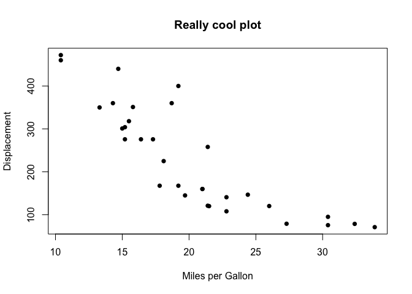

### Problem 1

Write the test\_df2 table to a file named “write\_test.txt” with the `write.table` function.

**Answer:**

``` r
test_df2 <- data.frame(pet=c("dog", "cat"), livestock=c("cow", "sheep"), stringsAsFactors = FALSE)
write.table(test_df2, file="newfile.txt", quote=FALSE, sep="\t", col.names=TRUE, row.names=FALSE)
```

### Problem 2

-   Load the dataset mtcars with the command `data(mtcars)`.

-   What class is this object?

-   Contrast the outputs of `summary` and `str`.

-   Take a look at the first 10 rows of this object with `head(mtcars, 10)`.

**Answer**:

``` r
data(mtcars)
class(mtcars)
```

    ## [1] "data.frame"

``` r
summary(mtcars)
```

    ##       mpg             cyl             disp             hp       
    ##  Min.   :10.40   Min.   :4.000   Min.   : 71.1   Min.   : 52.0  
    ##  1st Qu.:15.43   1st Qu.:4.000   1st Qu.:120.8   1st Qu.: 96.5  
    ##  Median :19.20   Median :6.000   Median :196.3   Median :123.0  
    ##  Mean   :20.09   Mean   :6.188   Mean   :230.7   Mean   :146.7  
    ##  3rd Qu.:22.80   3rd Qu.:8.000   3rd Qu.:326.0   3rd Qu.:180.0  
    ##  Max.   :33.90   Max.   :8.000   Max.   :472.0   Max.   :335.0  
    ##       drat             wt             qsec             vs        
    ##  Min.   :2.760   Min.   :1.513   Min.   :14.50   Min.   :0.0000  
    ##  1st Qu.:3.080   1st Qu.:2.581   1st Qu.:16.89   1st Qu.:0.0000  
    ##  Median :3.695   Median :3.325   Median :17.71   Median :0.0000  
    ##  Mean   :3.597   Mean   :3.217   Mean   :17.85   Mean   :0.4375  
    ##  3rd Qu.:3.920   3rd Qu.:3.610   3rd Qu.:18.90   3rd Qu.:1.0000  
    ##  Max.   :4.930   Max.   :5.424   Max.   :22.90   Max.   :1.0000  
    ##        am              gear            carb      
    ##  Min.   :0.0000   Min.   :3.000   Min.   :1.000  
    ##  1st Qu.:0.0000   1st Qu.:3.000   1st Qu.:2.000  
    ##  Median :0.0000   Median :4.000   Median :2.000  
    ##  Mean   :0.4062   Mean   :3.688   Mean   :2.812  
    ##  3rd Qu.:1.0000   3rd Qu.:4.000   3rd Qu.:4.000  
    ##  Max.   :1.0000   Max.   :5.000   Max.   :8.000

``` r
str(mtcars)
```

    ## 'data.frame':    32 obs. of  11 variables:
    ##  $ mpg : num  21 21 22.8 21.4 18.7 18.1 14.3 24.4 22.8 19.2 ...
    ##  $ cyl : num  6 6 4 6 8 6 8 4 4 6 ...
    ##  $ disp: num  160 160 108 258 360 ...
    ##  $ hp  : num  110 110 93 110 175 105 245 62 95 123 ...
    ##  $ drat: num  3.9 3.9 3.85 3.08 3.15 2.76 3.21 3.69 3.92 3.92 ...
    ##  $ wt  : num  2.62 2.88 2.32 3.21 3.44 ...
    ##  $ qsec: num  16.5 17 18.6 19.4 17 ...
    ##  $ vs  : num  0 0 1 1 0 1 0 1 1 1 ...
    ##  $ am  : num  1 1 1 0 0 0 0 0 0 0 ...
    ##  $ gear: num  4 4 4 3 3 3 3 4 4 4 ...
    ##  $ carb: num  4 4 1 1 2 1 4 2 2 4 ...

``` r
head(mtcars, 10)
```

    ##                    mpg cyl  disp  hp drat    wt  qsec vs am gear carb
    ## Mazda RX4         21.0   6 160.0 110 3.90 2.620 16.46  0  1    4    4
    ## Mazda RX4 Wag     21.0   6 160.0 110 3.90 2.875 17.02  0  1    4    4
    ## Datsun 710        22.8   4 108.0  93 3.85 2.320 18.61  1  1    4    1
    ## Hornet 4 Drive    21.4   6 258.0 110 3.08 3.215 19.44  1  0    3    1
    ## Hornet Sportabout 18.7   8 360.0 175 3.15 3.440 17.02  0  0    3    2
    ## Valiant           18.1   6 225.0 105 2.76 3.460 20.22  1  0    3    1
    ## Duster 360        14.3   8 360.0 245 3.21 3.570 15.84  0  0    3    4
    ## Merc 240D         24.4   4 146.7  62 3.69 3.190 20.00  1  0    4    2
    ## Merc 230          22.8   4 140.8  95 3.92 3.150 22.90  1  0    4    2
    ## Merc 280          19.2   6 167.6 123 3.92 3.440 18.30  1  0    4    4

### Problem 3

-   Plot a scatterplot of miles per gallon against displacement in the mtcars table.

-   Change the axes names and point type.

**Answer:**

``` r
plot(mtcars$mpg, mtcars$disp, xlab="Miles per Gallon", ylab="Displacement", main="Really cool plot", pch=16)
```



### Problem 4

-   Make a copy of the mtcars object, but only keep the rows called: “Valiant”, “Merc 230”, and “Lotus Europa”.

-   Make a another copy of this object, but this time only with rows that contain “Merc” using grep.

-   Get the mean miles per gallon for all Merc cars.

**Answer:**

``` r
mtcars_subset <- mtcars[c("Valiant", "Merc 230", "Lotus Europa"), ]
mtcars_subset
```

    ##               mpg cyl  disp  hp drat    wt  qsec vs am gear carb
    ## Valiant      18.1   6 225.0 105 2.76 3.460 20.22  1  0    3    1
    ## Merc 230     22.8   4 140.8  95 3.92 3.150 22.90  1  0    4    2
    ## Lotus Europa 30.4   4  95.1 113 3.77 1.513 16.90  1  1    5    2

``` r
mtcars_Merc <- mtcars[grep("Merc", rownames(mtcars), value=TRUE), ]
mtcars_Merc
```

    ##              mpg cyl  disp  hp drat   wt qsec vs am gear carb
    ## Merc 240D   24.4   4 146.7  62 3.69 3.19 20.0  1  0    4    2
    ## Merc 230    22.8   4 140.8  95 3.92 3.15 22.9  1  0    4    2
    ## Merc 280    19.2   6 167.6 123 3.92 3.44 18.3  1  0    4    4
    ## Merc 280C   17.8   6 167.6 123 3.92 3.44 18.9  1  0    4    4
    ## Merc 450SE  16.4   8 275.8 180 3.07 4.07 17.4  0  0    3    3
    ## Merc 450SL  17.3   8 275.8 180 3.07 3.73 17.6  0  0    3    3
    ## Merc 450SLC 15.2   8 275.8 180 3.07 3.78 18.0  0  0    3    3

``` r
mean(mtcars_Merc$mpg)
```

    ## [1] 19.01429

### Problem 5

-   Load the airquality dataset with `data(airquality)`.

-   How many NA values are in this table?

-   When you sum a logical vector TRUE is interpreted as 1 and FALSE is interpreted as 0. with this in mind how could you use the `rowSums` function to identify rows that have any NA values?

-   Make a new dataframe with rows with any NA values removed.

**Answer:**

``` r
data(airquality)
summary(airquality)
```

    ##      Ozone           Solar.R           Wind             Temp      
    ##  Min.   :  1.00   Min.   :  7.0   Min.   : 1.700   Min.   :56.00  
    ##  1st Qu.: 18.00   1st Qu.:115.8   1st Qu.: 7.400   1st Qu.:72.00  
    ##  Median : 31.50   Median :205.0   Median : 9.700   Median :79.00  
    ##  Mean   : 42.13   Mean   :185.9   Mean   : 9.958   Mean   :77.88  
    ##  3rd Qu.: 63.25   3rd Qu.:258.8   3rd Qu.:11.500   3rd Qu.:85.00  
    ##  Max.   :168.00   Max.   :334.0   Max.   :20.700   Max.   :97.00  
    ##  NA's   :37       NA's   :7                                       
    ##      Month            Day      
    ##  Min.   :5.000   Min.   : 1.0  
    ##  1st Qu.:6.000   1st Qu.: 8.0  
    ##  Median :7.000   Median :16.0  
    ##  Mean   :6.993   Mean   :15.8  
    ##  3rd Qu.:8.000   3rd Qu.:23.0  
    ##  Max.   :9.000   Max.   :31.0  
    ## 

``` r
which(rowSums(is.na(airquality)) > 0)
```

    ##  [1]   5   6  10  11  25  26  27  32  33  34  35  36  37  39  42  43  45
    ## [18]  46  52  53  54  55  56  57  58  59  60  61  65  72  75  83  84  96
    ## [35]  97  98 102 103 107 115 119 150

``` r
airquality_NArm <- airquality[-which(rowSums(is.na(airquality)) > 0),]
summary(airquality_NArm)
```

    ##      Ozone          Solar.R           Wind            Temp      
    ##  Min.   :  1.0   Min.   :  7.0   Min.   : 2.30   Min.   :57.00  
    ##  1st Qu.: 18.0   1st Qu.:113.5   1st Qu.: 7.40   1st Qu.:71.00  
    ##  Median : 31.0   Median :207.0   Median : 9.70   Median :79.00  
    ##  Mean   : 42.1   Mean   :184.8   Mean   : 9.94   Mean   :77.79  
    ##  3rd Qu.: 62.0   3rd Qu.:255.5   3rd Qu.:11.50   3rd Qu.:84.50  
    ##  Max.   :168.0   Max.   :334.0   Max.   :20.70   Max.   :97.00  
    ##      Month            Day       
    ##  Min.   :5.000   Min.   : 1.00  
    ##  1st Qu.:6.000   1st Qu.: 9.00  
    ##  Median :7.000   Median :16.00  
    ##  Mean   :7.216   Mean   :15.95  
    ##  3rd Qu.:9.000   3rd Qu.:22.50  
    ##  Max.   :9.000   Max.   :31.00
